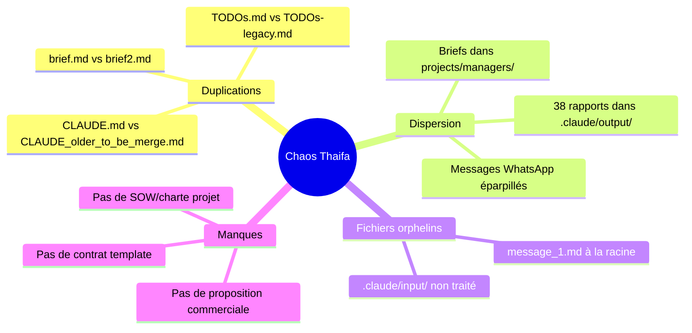

# Brief Complet : Mission Villa Thaifa

> **Date** : 2025-12-22
> **Auteur** : Omar El Mountassir
> **Version** : 2.0 (étendu avec vision globale + diagnostic chaos)

---

## 1. Vision Globale

### Objectif Stratégique

> **Omar veut gérer TOUT le côté digital de la Villa Thaifa.**

| Aspect                 | Description                                           |
| ---------------------- | ----------------------------------------------------- |
| **Périmètre**          | Gestion complète de la présence digitale              |
| **Plateformes**        | HotelRunner, Booking.com, Expedia, +20 autres OTAs    |
| **Client**             | M. Said Thaifa (78 ans, propriétaire)                 |
| **Statut contractuel** | ❌ **Aucun contrat signé** — Collaboration informelle |

### Besoin Urgent

> **Formaliser la relation** avec une proposition commerciale et/ou contrat.

Omar n'a **pas d'expérience** en rédaction de :

- Proposition commerciale / Devis
- Contrat de prestation de services
- Charte de projet (Statement of Work)

---

## 2. Priorités Actuelles

### Ce qui est mis de côté

L'idée de créer une **solution IA/agent personnalisée** est reportée.

### Focus immédiat

> Résoudre les **problèmes opérationnels actuels** de M. Thaifa d'abord.

| Priorité | Description                                           |
| -------- | ----------------------------------------------------- |
| 1        | Configuration complète HotelRunner                    |
| 2        | Inscription sur toutes les plateformes OTA supportées |
| 3        | Formaliser la relation (proposition/contrat)          |

---

## 3. TÂCHE : Introduction à l'équipe HWS

### Contexte

Premier contact avec **Ikram** de l'équipe HWS (Hospitality Web Services) Support de HotelRunner.

### Contrainte

> Pas de contrat signé → Quel **titre** utiliser pour me présenter ?

### Draft du message

```
👋 Ici Omar El Mountassir, [TITRE?] de la Villa Thaifa
Email: omar@el-mountassir.com
```

### Options de titre

| Option                                | Pour                                 | Contre                 | Recommandation    |
| ------------------------------------- | ------------------------------------ | ---------------------- | ----------------- |
| "Consultant digital"                  | Flexible, pro, pas besoin de contrat | Peut sembler externe   | ⭐ **RECOMMANDÉ** |
| "Responsable de la présence en ligne" | Descriptif, implique autorité        | Un peu long            | ✅ Bon choix      |
| "Chargé de la gestion digitale"       | Neutre, descriptif                   | Corporate              | Acceptable        |
| "Gestionnaire"                        | Simple                               | Trop vague             | ❌ Éviter         |
| "Administrateur"                      | Technique                            | Peut impliquer employé | ❌ Éviter         |

### Message proposé

```
👋 Bonjour,

Ici Omar El Mountassir, consultant digital pour la Villa Thaifa.
Email: omar@el-mountassir.com

Je gère la présence en ligne de l'établissement et je serai votre
interlocuteur principal pour toute question technique.

Bien cordialement,
Omar
```

---

## 4. TÂCHE : Capturer nouveau contact

### À ajouter dans `admin/contacts.md`

| Champ                  | Valeur                                            |
| ---------------------- | ------------------------------------------------- |
| **Nom**                | Ikram                                             |
| **Équipe**             | HWS Support Team (HotelRunner)                    |
| **Téléphone/WhatsApp** | +212 717 51 85 92                                 |
| **Profil**             | Femme marocaine, ~25-30 ans                       |
| **Rôle**               | Service client / Support technique                |
| **Contexte**           | Premier contact avec l'équipe support HotelRunner |
| **Date de contact**    | 2025-12-22                                        |

---

## 4b. Échange HWS (2025-12-22)

### Message envoyé

```
👋 , ici Omar El Mountassir, Consultant Digital - Villa Thaifa
omar@el-mountassir.com
```

### Réponse automatisée reçue

```
Bonjour,

Merci de nous avoir contacté, l´équipe de support va revenir vers vous
des que possible.

En cas d´attente trop longue, n´hésitez pas à nous contacter par email à
support@hospitalitywebservices.com ou visitez notre site d´aide où vous
trouverez toutes les vidéos utiles pour la gestion d´HotelRunner :
https://bit.ly/3Vf4zpQ

Hospitality Web Services
```

### Demande API HotelRunner

> **Ikram vérifie** auprès de l'équipe technique si HotelRunner a une **API** ou prévoit d'en développer une.
>
> **Raison** : L'automatisation via Chrome (Claude Code CLI `--chrome`) n'est pas idéale.
> **Question ouverte** : Existe-t-il de meilleures alternatives pour Claude Code CLI / Claude Agent SDK ?

### Service WebMaster HWS

HWS propose un service de **création/gestion de sites web** pour leurs clients.

| Établissement | URL |
|---------------|-----|
| Auberge Azul Ifni | https://aubergeazulifni.com/ |
| Riad Bianca | https://riad-bianca.com/ |
| Ourika Camp | https://ourikacamp.com/ |
| My City | https://my-city.ma/ |
| Kohinor Hotel | https://kohinorhotel.com/ |

> **Note** : Villa Thaifa fait partie de leurs clients → **Potentiel pour site web direct** (réservations sans commission Booking.com)

---

## 5. DIAGNOSTIC : État du répertoire Thaifa

### Verdict

> ⚠️ **CHAOS TOTAL** — Structure incohérente, fichiers dispersés, duplications multiples.

### Problèmes identifiés



### Inventaire détaillé

| Problème                    | Fichiers concernés                                                   | Impact                   |
| --------------------------- | -------------------------------------------------------------------- | ------------------------ |
| **2 CLAUDE.md à fusionner** | `CLAUDE.md` (206 lignes), `CLAUDE_older_to_be_merge.md` (255 lignes) | Confusion sur les règles |
| **Briefs dupliqués**        | `projects/managers/.../brief.md`, `brief2.md`                        | Lequel est le bon ?      |
| **TODOs multiples**         | `tasks/TODOs.md`, `.claude/input/TODOs-legacy.md`                    | Perte de traçabilité     |
| **38 rapports dispersés**   | `.claude/output/2025/Q4/reports/*`                                   | Difficile à retrouver    |
| **Fichiers racine**         | `message_1.md` (brainstorm brut)                                     | Désordre visuel          |

### Ce qui fonctionne bien

| Élément                   | Statut            |
| ------------------------- | ----------------- |
| Structure `state/` (SSOT) | ✅ Bien organisée |
| Dossier `admin/`          | ✅ Clair          |
| `docs/lessons-learned.md` | ✅ Utile          |

---

## 6. BESOIN : Templates Business

### Documents nécessaires pour formaliser la relation

| Document                    | Usage                                   | Priorité |
| --------------------------- | --------------------------------------- | -------- |
| **Proposition commerciale** | Présenter l'offre à M. Thaifa           | 🔴 P0    |
| **Statement of Work (SOW)** | Définir le périmètre, livrables, délais | 🔴 P0    |
| **Contrat de prestation**   | Formaliser légalement                   | 🟠 P1    |
| **Grille tarifaire**        | Justifier les prix                      | 🟡 P2    |

### Structure recommandée (Consulting Proposal)

D'après les meilleures pratiques 2025 :

```
1. Page de garde + Résumé exécutif
2. Problème / Besoins du client
3. Solution proposée (Scope of Work)
4. Méthodologie / Approche
5. Livrables et jalons (Timeline)
6. Tarification (fixe, horaire, ou tiers)
7. Qualifications / Portfolio
8. Termes et conditions
9. Signature
```

### Ressources pour créer les templates

| Source                  | URL                                                                                                                                 | Type                 |
| ----------------------- | ----------------------------------------------------------------------------------------------------------------------------------- | -------------------- |
| Consulting Success      | [consultingsuccess.com](https://www.consultingsuccess.com/consulting-proposal-template)                                             | Proposal template    |
| Bonsai                  | [hellobonsai.com](https://www.hellobonsai.com/proposal-template/individual-consultant)                                              | Freelance consultant |
| ClickUp                 | [clickup.com](https://clickup.com/templates/statement-of-work/digital-marketing-agencies)                                           | SOW template         |
| Digital Project Manager | [thedigitalprojectmanager.com](https://thedigitalprojectmanager.com/project-management/how-write-statement-of-work-complete-guide/) | SOW guide 2025       |
| Proposify               | [proposify.com](https://www.proposify.com/proposal-templates/statement-work-template)                                               | Free SOW template    |

---

## 7. PLAN DE RESTRUCTURATION

### Phase 1 : Nettoyage immédiat (Aujourd'hui)

- [ ] Fusionner `CLAUDE.md` + `CLAUDE_older_to_be_merge.md`
- [ ] Supprimer `message_1.md` (contenu capturé ici)
- [ ] Archiver/supprimer briefs obsolètes dans `projects/managers/`
- [ ] Consolider TODOs (legacy → archive)

### Phase 2 : Création templates business (Cette semaine)

- [ ] Créer `templates/business/proposal.md` — Proposition commerciale
- [ ] Créer `templates/business/sow.md` — Statement of Work
- [ ] Créer `templates/business/contract.md` — Contrat prestation

### Phase 3 : Réorganisation rapports (Cette semaine)

- [ ] Décider : garder `.claude/output/` ou migrer vers `docs/reports/`
- [ ] Créer un INDEX des rapports existants
- [ ] Archiver les rapports obsolètes

### Phase 4 : Formalisation relation Thaifa (Prochaines étapes)

- [ ] Rédiger proposition commerciale pour M. Thaifa
- [ ] Définir périmètre (SOW) clair
- [ ] Présenter et faire signer

---

## 8. Structure cible

```
thaifa/
├── CLAUDE.md                    # Context IA (fusionné, unique)
├── admin/                       # Credentials, contacts, profil client
├── briefs/                      # Briefs pour instances IA
├── communication/               # Échanges (WhatsApp, emails)
├── docs/                        # Documentation
│   ├── lessons-learned.md
│   ├── reports/                 # Rapports consolidés
│   └── templates/               # Templates locaux si besoin
├── state/                       # SSOT (current, baseline, planned, etc.)
├── tasks/                       # TODOs actifs
└── .claude/                     # Config technique Claude
    ├── input/                   # Inbox pour traitement
    └── output/                  # Outputs (à archiver régulièrement)
```

### À supprimer / archiver

| Élément                         | Action                         |
| ------------------------------- | ------------------------------ |
| `CLAUDE_older_to_be_merge.md`   | Fusionner puis supprimer       |
| `message_1.md`                  | Supprimer (contenu ici)        |
| `projects/managers/`            | Évaluer : archiver ou intégrer |
| `.claude/input/TODOs-legacy.md` | Archiver                       |

---

## 9. Actions immédiates requises

### Pour Omar (décisions)

- [ ] Valider le titre "Consultant digital" pour HWS
- [ ] Valider le message d'introduction proposé
- [ ] Confirmer si on lance la restructuration maintenant

### Pour Claude (exécution)

- [ ] Ajouter Ikram dans `admin/contacts.md`
- [ ] Envoyer message d'introduction sur WhatsApp (après validation)
- [ ] Commencer fusion CLAUDE.md (après validation)
- [ ] Rechercher/créer templates business

---

## 10. Notes importantes

### Contexte de départ

> "On a très très mal démarré tout cela !" — Omar

Ce brief documente la situation réelle pour permettre un **reset propre**.

### Philosophie

| Principe                      | Application                     |
| ----------------------------- | ------------------------------- |
| SSOT (Single Source of Truth) | Un seul endroit par type d'info |
| Praxis > Theory               | Agir, pas juste planifier       |
| Pour les IAs ET les humains   | Structure claire, visuelle      |

---

_Brief v2.0 — Capturant la vision globale + diagnostic du chaos_
_Généré 2025-12-22 à partir de l'exploration complète du répertoire_
