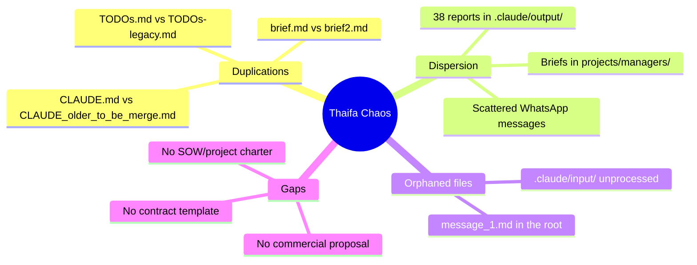

# Complete Brief: Villa Thaifa Mission

> **Date**: 2025-12-22
> **Author**: Omar El Mountassir
> **Version**: 2.0 (expanded with global vision + chaos diagnostic)

---

## 1. Global Vision

### Strategic Objective

> **Omar wants to manage ALL the digital side of Villa Thaifa.**

| Aspect                 | Description                                        |
| ---------------------- | -------------------------------------------------- |
| **Scope**              | Complete management of the digital presence        |
| **Platforms**          | HotelRunner, Booking.com, Expedia, +20 other OTAs  |
| **Client**             | Mr. Said Thaifa (78 years old, owner)              |
| **Contractual status** | ❌ **No signed contract** — Informal collaboration |

### Urgent Need

> **Formalize the relationship** with a commercial proposal and/or contract.

Omar has **no experience** in drafting:

- Commercial proposal / Quote
- Service provision contract
- Project charter (Statement of Work)

---

## 2. Current Priorities

### What is put aside

The idea of creating a **custom AI/agent solution** is postponed.

### Immediate focus

> Solve Mr. Thaifa's **current operational problems** first.

| Priority | Description                                    |
| -------- | ---------------------------------------------- |
| 1        | Complete HotelRunner configuration             |
| 2        | Registration on all supported OTA platforms    |
| 3        | Formalize the relationship (proposal/contract) |

---

## 3. TASK: Introduction to the HWS team

### Context

First contact with **Ikram** from the HWS (Hospitality Web Services) Support team of HotelRunner.

### Constraint

> No signed contract → What **title** to use to present myself?

### Message Draft

```text
👋 This is Omar El Mountassir, [TITLE?] of Villa Thaifa
Email: omar@el-mountassir.com
```

### Title Options

| Option                       | Pros                                | Cons                 | Recommendation     |
| ---------------------------- | ----------------------------------- | -------------------- | ------------------ |
| "Digital Consultant"         | Flexible, pro, no need for contract | Might seem external  | ⭐ **RECOMMENDED** |
| "Online Presence Manager"    | Descriptive, implies authority      | A bit long           | ✅ Good choice     |
| "Digital Management Officer" | Neutral, descriptive                | Corporate            | Acceptable         |
| "Manager"                    | Simple                              | Too vague            | ❌ Avoid           |
| "Administrator"              | Technical                           | Might imply employee | ❌ Avoid           |

### Proposed message

```text
👋 Hello,

This is Omar El Mountassir, digital consultant for Villa Thaifa.
Email: omar@el-mountassir.com

I manage the establishment's online presence and I will be your
main point of contact for any technical questions.

Best regards,
Omar
```

---

## 4. TASK: Capture new contact

### To add in `admin/contacts.md`

| Field              | Value                                           |
| ------------------ | ----------------------------------------------- |
| **Name**           | Ikram                                           |
| **Team**           | HWS Support Team (HotelRunner)                  |
| **Phone/WhatsApp** | +212 717 51 85 92                               |
| **Profile**        | Moroccan woman, ~25-30 years old                |
| **Role**           | Customer service / Technical support            |
| **Context**        | First contact with the HotelRunner support team |
| **Contact date**   | 2025-12-22                                      |

---

## 4b. HWS Exchange (2025-12-22)

### Sent message

```text
👋 , this is Omar El Mountassir, Digital Consultant - Villa Thaifa
omar@el-mountassir.com
```

### Received automated response

```text
Hello,

Thank you for contacting us, the support team will get back to you
as soon as possible.

In case of a too long wait, do not hesitate to contact us by email at
support@hospitalitywebservices.com or visit our help site where you
will find all useful videos for managing HotelRunner:
https://bit.ly/3Vf4zpQ

Hospitality Web Services
```

### HotelRunner API Request

> **Ikram is checking** with the technical team if HotelRunner has an **API** or plans to develop one.
>
> **Reason**: Automation via Chrome (Claude Code CLI `--chrome`) is not ideal.
> **Open question**: Are there better alternatives for Claude Code CLI / Claude Agent SDK?

### HWS WebMaster Service

HWS offers a **website creation/management** service for their clients.

| Establishment     | URL                          |
| ----------------- | ---------------------------- |
| Auberge Azul Ifni | https://aubergeazulifni.com/ |
| Riad Bianca       | https://riad-bianca.com/     |
| Ourika Camp       | https://ourikacamp.com/      |
| My City           | https://my-city.ma/          |
| Kohinor Hotel     | https://kohinorhotel.com/    |

> **Note**: Villa Thaifa is among their clients → **Potential for direct website** (reservations without Booking.com commission)

---

## 5. DIAGNOSTIC: Thaifa repository status

### Verdict

> ⚠️ **TOTAL CHAOS** — Inconsistent structure, scattered files, multiple duplications.

### Identified problems



### Detailed inventory

| Problem                  | Affected files                                                     | Impact                      |
| ------------------------ | ------------------------------------------------------------------ | --------------------------- |
| **2 CLAUDE.md to merge** | `CLAUDE.md` (206 lines), `CLAUDE_older_to_be_merge.md` (255 lines) | Confusion about rules       |
| **Duplicated briefs**    | `projects/managers/.../brief.md`, `brief2.md`                      | Which one is the right one? |
| **Multiple TODOs**       | `tasks/TODOs.md`, `.claude/input/TODOs-legacy.md`                  | Loss of traceability        |
| **38 scattered reports** | `.claude/output/2025/Q4/reports/*`                                 | Hard to find                |
| **Root files**           | `message_1.md` (raw brainstorm)                                    | Visual clutter              |

### What works well

| Element                   | Status            |
| ------------------------- | ----------------- |
| Structure `state/` (SSOT) | ✅ Well organized |
| Folder `admin/`           | ✅ Clear          |
| `docs/lessons-learned.md` | ✅ Useful         |

---

## 6. NEED: Business Templates

### Documents needed to formalize the relationship

| Document                    | Usage                                 | Priority |
| --------------------------- | ------------------------------------- | -------- |
| **Commercial proposal**     | Present the offer to Mr. Thaifa       | 🔴 P0    |
| **Statement of Work (SOW)** | Define scope, deliverables, deadlines | 🔴 P0    |
| **Service contract**        | Formalize legally                     | 🟠 P1    |
| **Pricing grid**            | Justify prices                        | 🟡 P2    |

### Recommended structure (Consulting Proposal)

According to 2025 best practices:

```text
1. Cover page + Executive summary
2. Problem / Client needs
3. Proposed solution (Scope of Work)
4. Methodology / Approach
5. Deliverables and milestones (Timeline)
6. Pricing (fixed, hourly, or retainers)
7. Qualifications / Portfolio
8. Terms and conditions
9. Signature
```

### Resources to create templates

| Source                  | URL                                                                                                                                 | Type                 |
| ----------------------- | ----------------------------------------------------------------------------------------------------------------------------------- | -------------------- |
| Consulting Success      | [consultingsuccess.com](https://www.consultingsuccess.com/consulting-proposal-template)                                             | Proposal template    |
| Bonsai                  | [hellobonsai.com](https://www.hellobonsai.com/proposal-template/individual-consultant)                                              | Freelance consultant |
| ClickUp                 | [clickup.com](https://clickup.com/templates/statement-of-work/digital-marketing-agencies)                                           | SOW template         |
| Digital Project Manager | [thedigitalprojectmanager.com](https://thedigitalprojectmanager.com/project-management/how-write-statement-of-work-complete-guide/) | SOW guide 2025       |
| Proposify               | [proposify.com](https://www.proposify.com/proposal-templates/statement-work-template)                                               | Free SOW template    |

---

## 7. RESTRUCTURING PLAN

### Phase 1: Immediate cleanup (Today)

- [ ] Merge `CLAUDE.md` + `CLAUDE_older_to_be_merge.md`
- [ ] Delete `message_1.md` (content captured here)
- [ ] Archive/delete obsolete briefs in `projects/managers/`
- [ ] Consolidate TODOs (legacy → archive)

### Phase 2: Business templates creation (This week)

- [ ] Create `templates/business/proposal.md` — Commercial proposal
- [ ] Create `templates/business/sow.md` — Statement of Work
- [ ] Create `templates/business/contract.md` — Service contract

### Phase 3: Reports reorganization (This week)

- [ ] Decide: keep `.claude/output/` or migrate to `docs/reports/`
- [ ] Create an INDEX of existing reports
- [ ] Archive obsolete reports

### Phase 4: Thaifa relationship formalization (Next steps)

- [ ] Draft commercial proposal for Mr. Thaifa
- [ ] Define clear scope (SOW)
- [ ] Present and get signed

---

## 8. Target structure

```text
thaifa/
├── CLAUDE.md                    # AI Context (merged, unique)
├── admin/                       # Credentials, contacts, client profile
├── briefs/                      # Briefs for AI instances
├── communication/               # Exchanges (WhatsApp, emails)
├── docs/                        # Documentation
│   ├── lessons-learned.md
│   ├── reports/                 # Consolidated reports
│   └── templates/               # Local templates if needed
├── state/                       # SSOT (current, baseline, planned, etc.)
├── tasks/                       # Active TODOs
└── .claude/                     # Claude technical config
    ├── input/                   # Inbox for processing
    └── output/                  # Outputs (to be archived regularly)
```

### To delete / archive

| Element                         | Action                         |
| ------------------------------- | ------------------------------ |
| `CLAUDE_older_to_be_merge.md`   | Merge then delete              |
| `message_1.md`                  | Delete (content here)          |
| `projects/managers/`            | Evaluate: archive or integrate |
| `.claude/input/TODOs-legacy.md` | Archive                        |

---

## 9. Immediate actions required

### For Omar (decisions)

- [ ] Validate the title "Digital Consultant" for HWS
- [ ] Validate the proposed introduction message
- [ ] Confirm if we start the restructuring now

### For Claude (execution)

- [ ] Add Ikram in `admin/contacts.md`
- [ ] Send introduction message on WhatsApp (after validation)
- [ ] Start CLAUDE.md merge (after validation)
- [ ] Search/create business templates

---

## 10. Important notes

### Starting context

> "We started all this very very badly!" — Omar

This brief documents the real situation to allow a **clean reset**.

### Philosophy

| Principle                     | Application                  |
| ----------------------------- | ---------------------------- |
| SSOT (Single Source of Truth) | Only one place per info type |
| Praxis > Theory               | Act, not just plan           |
| For AIs AND humans            | Clear, visual structure      |

---

_Brief v2.0 — Capturing the global vision + chaos diagnostic_
_Generated 2025-12-22 from the full exploration of the repository_
