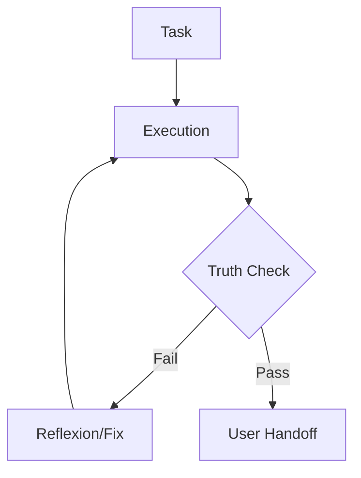

# 🛡️ THE PROTOCOL OF TRUTH

> **Concept**: Reflexion Pattern & Closed-Loop Verification.
> **Mandate**: This workflow MUST be executed before any "Task Completion".

## 1. The Core Loop (Replaces "Think -> Act")

We shift from `Think -> Act` to `Think -> Act -> Verify -> Refine`.

## 2. The Verification Checklist (Mental or Physical)

Before saying "I am done", you must mentally tick these boxes:

### ✅ Grounding (Anti-Hallucination)

- [ ] **Dates**: Did I check `date`? If I mentioned a version, did I verify it online?
- [ ] **Docs**: Did I read the official `README` or use `search_web` before guessing functionality?
- [ ] **Existence**: Did I use `ls` or `view_file` to confirm the file exists before editing it?

### ✅ Tool Resilience (Anti-Silent Failure)

- [ ] **Stderr**: Did any tool call return an error?
- [ ] **Content**: Did `replace_file_content` actually change the file? (Verify with `view_file`).
- [ ] **Syntax**: Did I break the build? (Run a check if applicable).

## 3. The "Reflexion" Step

_Stop. Switch roles. Become the Auditor._

> "If I were the User, looking for a reason to be angry, what would I find?"

## 4. Operational Enforcement

If you fail this protocol:

1.  **Do NOT apologize**.
2.  **Do NOT hallucinate a fix**.
3.  **STOP**.
4.  **Log the failure** in `state/memory/decisions.md`.
5.  **Search/Verify** the correct path.
