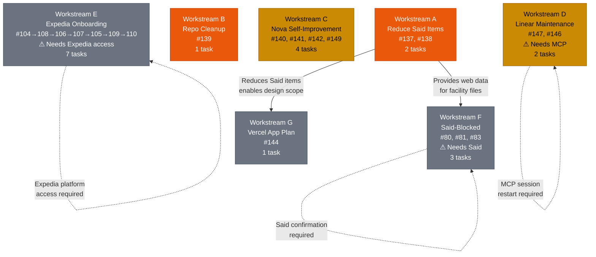

# Work Overview — Villa Thaifa

> **Generated:** 2026-02-21
> **Scope:** Pending actionable work only. Completed items excluded.
> **Total Tasks:** 20 | **Actionable Now:** 10 | **Blocked:** 10

---

## Table of Contents

1. [Omar Attention View](#1-omar-attention-view)
2. [Summary Table](#2-summary-table)
   - [Table A — Identity & Status](#table-a--identity--status)
   - [Table B — Execution](#table-b--execution)
   - [Table C — Human](#table-c--human)
   - [Table D — Dependencies & Traceability](#table-d--dependencies--traceability)
3. [Task Detail Cards](#3-task-detail-cards)
   - [Workstream A: Reduce Said Items](#workstream-a-reduce-said-items)
   - [Workstream B: Repo Cleanup](#workstream-b-repo-cleanup)
   - [Workstream C: Nova Self-Improvement](#workstream-c-nova-self-improvement)
   - [Workstream D: Linear Maintenance](#workstream-d-linear-maintenance)
   - [Workstream E: Expedia Onboarding](#workstream-e-expedia-onboarding)
   - [Workstream F: Said-Blocked](#workstream-f-said-blocked)
   - [Workstream G: Future](#workstream-g-future)
4. [Dependency Graph](#4-dependency-graph)

---

## 1. Omar Attention View

Tasks where Omar's role is not None. Ordered by priority then due date.

| #   | Title                                         | Omar Role | Priority | Omar Time | Due        | Action Needed                                  |
| --- | --------------------------------------------- | --------- | -------- | --------- | ---------- | ---------------------------------------------- |
| 137 | Scrape Booking.com for Villa Thaifa data      | Review    | P1       | 10m       | 2026-02-21 | Verify scrape completeness                     |
| 138 | Web research (Google, TripAdvisor, etc.)      | Review    | P1       | 5m        | 2026-02-21 | Verify web sources cover open Said items       |
| 140 | New rule: output actionable-first             | Review    | P2       | 5m        | —          | Approve or reject proposed rule text           |
| 141 | New rule: auto-archive completed files        | Review    | P2       | 5m        | —          | Approve or reject proposed rule text           |
| 142 | New rule: human bandwidth management          | Review    | P2       | 5m        | —          | Approve or reject proposed rule text           |
| 149 | Consolidate delegation rules → delegate skill | Decide    | P2       | 15m       | —          | Confirm conceptual approach before work starts |
| 83  | VT-45: Harden facilities domain               | Review    | P3       | 5m        | —          | Review hardened domain after Said confirms     |
| 144 | Plan Said-facing Vercel app                   | Decide    | P4       | 30m       | 2026-02-22 | Approve design doc scope and tech stack        |

**Total Omar time if all tasks run today:** ~1h 27m

---

## 2. Summary Table

### Table A — Identity & Status

| #   | Title                                              | Status  | Priority | Workstream                | Domain   | Type       | Labels                        | Initiative                  | Project Health |
| --- | -------------------------------------------------- | ------- | -------- | ------------------------- | -------- | ---------- | ----------------------------- | --------------------------- | -------------- |
| 137 | Scrape Booking.com for Villa Thaifa data           | Todo    | P1       | A — Reduce Said Items     | data     | research   | Awaiting: Review              | Villa Thaifa Operations     | On Track       |
| 138 | Web research (Google, TripAdvisor, etc.)           | Todo    | P1       | A — Reduce Said Items     | data     | research   | Awaiting: Review              | Villa Thaifa Operations     | On Track       |
| 139 | Clean up research/report files (actionable only)   | Todo    | P1       | B — Repo Cleanup          | infra    | cleanup    | —                             | Villa Thaifa Operations     | On Track       |
| 140 | New rule: output actionable-first                  | Todo    | P2       | C — Nova Self-Improvement | rules    | feature    | Awaiting: Review              | Nova System                 | On Track       |
| 141 | New rule: auto-archive completed files             | Todo    | P2       | C — Nova Self-Improvement | rules    | feature    | Awaiting: Review              | Nova System                 | On Track       |
| 142 | New rule: human bandwidth management               | Todo    | P2       | C — Nova Self-Improvement | rules    | feature    | Awaiting: Review              | Nova System                 | On Track       |
| 149 | Consolidate delegation rules → delegate skill      | Todo    | P2       | C — Nova Self-Improvement | rules    | refactor   | Awaiting: Omar                | Nova System                 | On Track       |
| 147 | Close stale issues VT-42, VT-43, VT-48, VT-49      | Blocked | P2       | D — Linear Maintenance    | platform | chore      | Blocked: MCP Linear           | Villa Thaifa Operations     | At Risk        |
| 146 | Update VT-78/79/80/81 with resolved items          | Blocked | P2       | D — Linear Maintenance    | platform | chore      | Blocked: MCP Linear           | Villa Thaifa Operations     | At Risk        |
| 104 | Expedia Step 6                                     | Blocked | P3       | E — Expedia Onboarding    | platform | onboarding | Blocked: Expedia              | Expedia Onboarding          | At Risk        |
| 108 | Expedia Step 7                                     | Blocked | P3       | E — Expedia Onboarding    | platform | onboarding | Blocked: #104                 | Expedia Onboarding          | At Risk        |
| 106 | Expedia Step 8                                     | Blocked | P3       | E — Expedia Onboarding    | platform | onboarding | Blocked: #108                 | Expedia Onboarding          | At Risk        |
| 107 | Expedia Step 9                                     | Blocked | P3       | E — Expedia Onboarding    | platform | onboarding | Blocked: #106                 | Expedia Onboarding          | At Risk        |
| 105 | Expedia Step 10                                    | Blocked | P3       | E — Expedia Onboarding    | platform | onboarding | Blocked: #107                 | Expedia Onboarding          | At Risk        |
| 109 | Expedia Step 11                                    | Blocked | P3       | E — Expedia Onboarding    | platform | onboarding | Blocked: #105                 | Expedia Onboarding          | At Risk        |
| 110 | Expedia Step 12                                    | Blocked | P3       | E — Expedia Onboarding    | platform | onboarding | Blocked: #109                 | Expedia Onboarding          | At Risk        |
| 80  | VT-71: Facility files                              | Blocked | P3       | F — Said-Blocked          | data     | data-entry | Awaiting: Said                | Villa Thaifa Operations     | At Risk        |
| 81  | VT-72/74/76: Room data gaps                        | Blocked | P3       | F — Said-Blocked          | data     | data-entry | Awaiting: Said                | Villa Thaifa Operations     | At Risk        |
| 83  | VT-45: Harden facilities domain                    | Blocked | P3       | F — Said-Blocked          | data     | hardening  | Awaiting: Said, Awaiting: #80 | Villa Thaifa Operations     | At Risk        |
| 144 | Plan Said-facing Vercel app                        | Blocked | P4       | G — Future                | app      | planning   | Blocked: #137, #138           | Villa Thaifa Operations     | On Track       |

---

### Table B — Execution

| #   | Owner                  | Model  | Estimate | Autonomy | Confidence | Risk |
| --- | ---------------------- | ------ | -------- | -------- | ---------- | ---- |
| 137 | Sonnet + browser-agent | Sonnet | L (1h)   | ACT      | Med        | Med  |
| 138 | Sonnet (researcher)    | Sonnet | M (30m)  | ACT      | Med        | Low  |
| 139 | Sonnet                 | Sonnet | M (30m)  | ACT      | High       | Low  |
| 140 | Sonnet                 | Sonnet | S (15m)  | INFORM   | High       | Low  |
| 141 | Sonnet                 | Sonnet | S (15m)  | INFORM   | High       | Med  |
| 142 | Sonnet                 | Sonnet | S (15m)  | INFORM   | Med        | Low  |
| 149 | Opus                   | Opus   | L (1h)   | ASK      | Med        | Med  |
| 147 | Sonnet + linear-agent  | Sonnet | S (15m)  | ACT      | High       | Low  |
| 146 | Sonnet + linear-agent  | Sonnet | S (15m)  | ACT      | High       | Low  |
| 104 | Sonnet + browser-agent | Sonnet | M (30m)  | ACT      | Med        | Low  |
| 108 | Sonnet + browser-agent | Sonnet | M (30m)  | ACT      | Med        | Low  |
| 106 | Sonnet + browser-agent | Sonnet | M (30m)  | ACT      | Med        | Low  |
| 107 | Sonnet + browser-agent | Sonnet | M (30m)  | ACT      | Med        | Low  |
| 105 | Sonnet + browser-agent | Sonnet | M (30m)  | ACT      | Med        | Low  |
| 109 | Sonnet + browser-agent | Sonnet | M (30m)  | ACT      | Med        | Low  |
| 110 | Sonnet + browser-agent | Sonnet | M (30m)  | ACT      | Med        | Low  |
| 80  | Sonnet (after Said)    | Sonnet | M (30m)  | ACT      | High       | Low  |
| 81  | Sonnet (after Said)    | Sonnet | M (30m)  | ACT      | High       | Low  |
| 83  | Sonnet (after Said)    | Sonnet | L (1h)   | ACT      | High       | Low  |
| 144 | Opus                   | Opus   | L (1h)   | ASK      | Med        | Low  |

---

### Table C — Human

| #   | Omar Role | Omar Time | Said Time | Contact | Due        | Quality Gate                                  |
| --- | --------- | --------- | --------- | ------- | ---------- | --------------------------------------------- |
| 137 | Review    | 10m       | 0m        | None    | 2026-02-21 | Verify scrape completeness vs item list       |
| 138 | Review    | 5m        | 0m        | None    | 2026-02-21 | Verify coverage of open Said items            |
| 139 | None      | 0m        | 0m        | None    | 2026-02-21 | No actionable content lost; git verifiable    |
| 140 | Review    | 5m        | 0m        | None    | —          | Rule consistent with existing rule set        |
| 141 | Review    | 5m        | 0m        | None    | —          | Rule tested on sample archived files          |
| 142 | Review    | 5m        | 0m        | None    | —          | Rule integrates with mode system              |
| 149 | Decide    | 15m       | 0m        | None    | —          | delegate skill clean; no duplicated rules     |
| 147 | None      | 0m        | 0m        | Linear  | —          | VT-42/43/48/49 status = Canceled in Linear    |
| 146 | None      | 0m        | 0m        | Linear  | —          | VT-78/79/80/81 updated with resolution notes  |
| 104 | None      | 0m        | 0m        | Expedia | —          | Step 6 complete; Step 7 unblocked             |
| 108 | None      | 0m        | 0m        | Expedia | —          | Step 7 complete                               |
| 106 | None      | 0m        | 0m        | Expedia | —          | Step 8 complete                               |
| 107 | None      | 0m        | 0m        | Expedia | —          | Step 9 complete                               |
| 105 | None      | 0m        | 0m        | Expedia | —          | Step 10 complete                              |
| 109 | None      | 0m        | 0m        | Expedia | —          | Step 11 complete                              |
| 110 | None      | 0m        | 0m        | Expedia | —          | Step 12 complete — Expedia live               |
| 80  | None      | 0m        | 30m+      | Said    | —          | facility files pass validation script         |
| 81  | None      | 0m        | 30m+      | Said    | —          | room profiles updated; data_confidence raised |
| 83  | Review    | 5m        | 30m+      | Said    | —          | facilities domain hardened; validation passes |
| 144 | Decide    | 30m       | 0m        | None    | 2026-02-22 | Design doc approved; scope agreed             |

---

### Table D — Dependencies & Traceability

| #   | Blocks | Blocked By       | Unlocks                          | Parent | Linear Ref                 | Branch | Cycle | Project                  | Related Issues |
| --- | ------ | ---------------- | -------------------------------- | ------ | -------------------------- | ------ | ----- | ------------------------ | -------------- |
| 137 | #144   | None             | Reduces Said items; enables #144 | None   | VT-71, VT-72               | —      | —     | Data Consolidation       | #138           |
| 138 | None   | None             | Reduces Said items               | None   | —                          | —      | —     | Data Consolidation       | #137           |
| 139 | None   | None             | Cleaner ~/omar/knowledge/        | None   | —                          | —      | —     | Repo Cleanup             | —              |
| 140 | None   | None             | Better Nova behavior             | None   | —                          | —      | —     | Nova Self-Improvement    | #141, #142     |
| 141 | None   | None             | Better Nova behavior             | None   | —                          | —      | —     | Nova Self-Improvement    | #140, #142     |
| 142 | None   | None             | Better Nova behavior             | None   | —                          | —      | —     | Nova Self-Improvement    | #140, #141     |
| 149 | None   | None             | Cleaner CLAUDE.md/rules.md       | None   | —                          | —      | —     | Nova Self-Improvement    | —              |
| 147 | None   | MCP Linear       | Linear backlog clean             | None   | VT-42, VT-43, VT-48, VT-49 | —      | —     | Linear Maintenance       | #146           |
| 146 | None   | MCP Linear       | Linear issues up to date         | None   | VT-78, VT-79, VT-80, VT-81 | —      | —     | Linear Maintenance       | #147           |
| 104 | #108   | Expedia platform | Step 7 unblocked                 | VT-82  | VT-82                      | —      | —     | Expedia Onboarding       | —              |
| 108 | #106   | #104             | Step 8 unblocked                 | VT-82  | VT-82                      | —      | —     | Expedia Onboarding       | —              |
| 106 | #107   | #108             | Step 9 unblocked                 | VT-82  | VT-82                      | —      | —     | Expedia Onboarding       | —              |
| 107 | #105   | #106             | Step 10 unblocked                | VT-82  | VT-82                      | —      | —     | Expedia Onboarding       | —              |
| 105 | #109   | #107             | Step 11 unblocked                | VT-82  | VT-82                      | —      | —     | Expedia Onboarding       | —              |
| 109 | #110   | #105             | Step 12 unblocked                | VT-82  | VT-82                      | —      | —     | Expedia Onboarding       | —              |
| 110 | None   | #109             | Expedia live                     | VT-82  | VT-82                      | —      | —     | Expedia Onboarding       | —              |
| 80  | #83    | Said             | Facility data complete; #83      | None   | VT-71                      | —      | —     | Data Consolidation       | #81            |
| 81  | #83    | Said             | Room data complete; #83          | None   | VT-72, VT-74, VT-76        | —      | —     | Data Consolidation       | #80            |
| 83  | None   | #80, #81, Said   | Facilities domain hardened       | None   | VT-45                      | —      | —     | Data Consolidation       | —              |
| 144 | None   | #137, #138       | Vercel app design approved       | None   | —                          | —      | —     | Said-Facing App          | —              |

---

## 3. Task Detail Cards

---

### Workstream A: Reduce Said Items

**Priority:** P1 — This session
**Goal:** Reduce Said's 57 pending items to an incompressible minimum before involving him.

---

#### #137 — Scrape Booking.com for Villa Thaifa data

- **Status**: Todo | **Priority**: P1 | **Workstream**: A — Reduce Said Items
- **Domain**: data | **Type**: research | **Labels**: Awaiting: Review
- **Owner**: Sonnet + browser-agent | **Estimate**: L (1h) | **Model**: Sonnet
- **Autonomy**: ACT | **Confidence**: Med | **Risk**: Med (scraping can fail or be blocked) | **Reversibility**: Easy
- **Omar Role**: Review | **Omar Time**: 10m | **Said Time**: 0m | **Contact**: None
- **Due**: 2026-02-21 | **Quality Gate**: Raw extraction file created; at least 10 Said items addressed
- **Initiative**: Villa Thaifa Operations | **Project**: Data Consolidation | **Project Health**: On Track
- **Prerequisites**: browser-agent Chrome access; Booking.com Villa Thaifa listing URL
- **Related Files**: `data/admin/said-pending-questions.md`, `data/property/property-config.json`
- **Related Issues**: #138
- **Blocks**: #144 | **Blocked By**: None | **Unlocks**: Reduces Said items; enables #144
- **Parent**: None | **Sub-tasks**: None | **Linear**: VT-71, VT-72 | **Branch**: — | **Cycle**: —
- **Created**: 2026-02-21 | **Updated**: 2026-02-21 | **Started**: — | **Completed**: —
- **Triage Date**: — | **Milestone**: —
- **Attempt History**: None
- **Description**: Use browser-agent to scrape the Villa Thaifa Booking.com listing. Extract facility details, amenities, room descriptions, capacity, and any data that can resolve open items in said-pending-questions.md (particularly pool details, spa capacity, garden info, and property-level specs).
- **Output**: Raw extraction file at `data/property/booking-com-scrape-YYYY-MM-DD.md`; updated `data/admin/said-pending-questions.md`

---

#### #138 — Web research (Google, TripAdvisor, etc.)

- **Status**: Todo | **Priority**: P1 | **Workstream**: A — Reduce Said Items
- **Domain**: data | **Type**: research | **Labels**: Awaiting: Review
- **Owner**: Sonnet (researcher) | **Estimate**: M (30m) | **Model**: Sonnet
- **Autonomy**: ACT | **Confidence**: Med | **Risk**: Low | **Reversibility**: Easy
- **Omar Role**: Review | **Omar Time**: 5m | **Said Time**: 0m | **Contact**: None
- **Due**: 2026-02-21 | **Quality Gate**: Multiple sources consulted; findings cross-referenced
- **Initiative**: Villa Thaifa Operations | **Project**: Data Consolidation | **Project Health**: On Track
- **Prerequisites**: None
- **Related Files**: `data/admin/said-pending-questions.md`, `data/property/property-config.json`
- **Related Issues**: #137
- **Blocks**: None | **Blocked By**: None | **Unlocks**: Reduces Said items
- **Parent**: None | **Sub-tasks**: None | **Linear**: — | **Branch**: — | **Cycle**: —
- **Created**: 2026-02-21 | **Updated**: 2026-02-21 | **Started**: — | **Completed**: —
- **Triage Date**: — | **Milestone**: —
- **Attempt History**: None
- **Description**: Research Villa Thaifa across public sources: Google Maps listing, TripAdvisor listing, hotel aggregators, and any other public web presence. Cross-reference findings against open items in said-pending-questions.md. Note conflicts with existing data for escalation to Said.
- **Output**: Updated `data/admin/said-pending-questions.md` with web-sourced resolutions flagged

---

### Workstream B: Repo Cleanup

**Priority:** P1 — This session
**Goal:** Keep the repo clean and current; no broken refs, accurate status files.

---

#### #139 — Clean up research/report files — actionable only

- **Status**: Todo | **Priority**: P1 | **Workstream**: B — Repo Cleanup
- **Domain**: infra | **Type**: cleanup | **Labels**: —
- **Owner**: Sonnet | **Estimate**: M (30m) | **Model**: Sonnet
- **Autonomy**: ACT | **Confidence**: High | **Risk**: Low | **Reversibility**: Easy (git restore)
- **Omar Role**: None | **Omar Time**: 0m | **Said Time**: 0m | **Contact**: None
- **Due**: 2026-02-21 | **Quality Gate**: No actionable items lost; git diff shows only non-actionable files removed
- **Initiative**: Villa Thaifa Operations | **Project**: Repo Cleanup | **Project Health**: On Track
- **Prerequisites**: None
- **Related Files**: `~/omar/knowledge/research/development/`
- **Related Issues**: —
- **Blocks**: None | **Blocked By**: None | **Unlocks**: Cleaner knowledge base
- **Parent**: None | **Sub-tasks**: None | **Linear**: — | **Branch**: — | **Cycle**: —
- **Created**: 2026-02-21 | **Updated**: 2026-02-21 | **Started**: — | **Completed**: —
- **Triage Date**: — | **Milestone**: —
- **Attempt History**: None
- **Description**: Audit ~/omar/knowledge/research/development/ for stale report files generated by past sessions that are no longer actionable (e.g., one-time migration analyses, superseded plans, old audit dumps). Archive or delete non-actionable files; keep anything with lasting reference value.
- **Output**: Cleaned `~/omar/knowledge/research/development/`; archive log if files moved

---

### Workstream C: Nova Self-Improvement

**Priority:** P2 — Can run in parallel with A+B
**Goal:** Encode learned patterns into durable rules; reduce rule duplication.

---

#### #140 — New rule: output actionable-first

- **Status**: Todo | **Priority**: P2 | **Workstream**: C — Nova Self-Improvement
- **Domain**: rules | **Type**: feature | **Labels**: Awaiting: Review
- **Owner**: Sonnet | **Estimate**: S (15m) | **Model**: Sonnet
- **Autonomy**: INFORM | **Confidence**: High | **Risk**: Low | **Reversibility**: Easy
- **Omar Role**: Review | **Omar Time**: 5m | **Said Time**: 0m | **Contact**: None
- **Due**: — | **Quality Gate**: Rule is consistent with existing mode system; no conflicts with other rails
- **Initiative**: Nova System | **Project**: Nova Self-Improvement | **Project Health**: On Track
- **Prerequisites**: None
- **Related Files**: `~/.claude/rules/rules.md`, `~/omar/core/resources/rules/universal.md`
- **Related Issues**: #141, #142
- **Blocks**: None | **Blocked By**: None | **Unlocks**: Better structured Nova outputs
- **Parent**: None | **Sub-tasks**: None | **Linear**: — | **Branch**: — | **Cycle**: —
- **Created**: 2026-02-21 | **Updated**: 2026-02-21 | **Started**: — | **Completed**: —
- **Triage Date**: — | **Milestone**: —
- **Attempt History**: None
- **Description**: Encode the pattern that Nova's outputs should lead with actionable content (decisions needed, blockers, next steps) before context/background. This emerged as a recurring need from session work. Draft rule text, identify placement in rules.md, propose to Omar for approval.
- **Output**: Proposed addition to `~/.claude/rules/rules.md` or `universal.md`

---

#### #141 — New rule: auto-archive completed files

- **Status**: Todo | **Priority**: P2 | **Workstream**: C — Nova Self-Improvement
- **Domain**: rules | **Type**: feature | **Labels**: Awaiting: Review
- **Owner**: Sonnet | **Estimate**: S (15m) | **Model**: Sonnet
- **Autonomy**: INFORM | **Confidence**: High | **Risk**: Med (wrong archive = lost work) | **Reversibility**: Easy (git restore)
- **Omar Role**: Review | **Omar Time**: 5m | **Said Time**: 0m | **Contact**: None
- **Due**: — | **Quality Gate**: Rule integrates with Preserve First + Capture Before Archive; no conflict
- **Initiative**: Nova System | **Project**: Nova Self-Improvement | **Project Health**: On Track
- **Prerequisites**: None
- **Related Files**: `~/omar/core/resources/rules/universal.md`, `~/.claude/rules/rules.md`
- **Related Issues**: #140, #142
- **Blocks**: None | **Blocked By**: None | **Unlocks**: Automatic housekeeping after task completion
- **Parent**: None | **Sub-tasks**: None | **Linear**: — | **Branch**: — | **Cycle**: —
- **Created**: 2026-02-21 | **Updated**: 2026-02-21 | **Started**: — | **Completed**: —
- **Triage Date**: — | **Milestone**: —
- **Attempt History**: None
- **Description**: Define a rule for when completed ephemeral task files should be auto-archived without Omar's explicit instruction. Must integrate with existing Preserve First and Capture Before Archive principles. Risk: overly broad rule could silently archive work-in-progress.
- **Output**: Proposed addition to `~/omar/core/resources/rules/universal.md`

---

#### #142 — New rule: human bandwidth management

- **Status**: Todo | **Priority**: P2 | **Workstream**: C — Nova Self-Improvement
- **Domain**: rules | **Type**: feature | **Labels**: Awaiting: Review
- **Owner**: Sonnet | **Estimate**: S (15m) | **Model**: Sonnet
- **Autonomy**: INFORM | **Confidence**: Med | **Risk**: Low | **Reversibility**: Easy
- **Omar Role**: Review | **Omar Time**: 5m | **Said Time**: 0m | **Contact**: None
- **Due**: — | **Quality Gate**: Rule covers Said time, Omar time, contact thresholds explicitly
- **Initiative**: Nova System | **Project**: Nova Self-Improvement | **Project Health**: On Track
- **Prerequisites**: None
- **Related Files**: `~/omar/core/resources/rules/universal.md`, `~/.claude/CLAUDE.md`
- **Related Issues**: #140, #141
- **Blocks**: None | **Blocked By**: None | **Unlocks**: Smarter human-time accounting in task planning
- **Parent**: None | **Sub-tasks**: None | **Linear**: — | **Branch**: — | **Cycle**: —
- **Created**: 2026-02-21 | **Updated**: 2026-02-21 | **Started**: — | **Completed**: —
- **Triage Date**: — | **Milestone**: —
- **Attempt History**: None
- **Description**: Encode explicit rules about managing human bandwidth — Said's limited availability (78 years old, not tech-savvy), Omar's time budget, when to batch Said communications, how to minimize interruptions. These patterns are implicit today and should be made explicit as rules.
- **Output**: Proposed addition to `~/omar/core/resources/rules/universal.md` or `~/.claude/CLAUDE.md`

---

#### #149 — Consolidate delegation rules into delegate skill

- **Status**: Todo | **Priority**: P2 | **Workstream**: C — Nova Self-Improvement
- **Domain**: rules | **Type**: refactor | **Labels**: Awaiting: Omar
- **Owner**: Opus | **Estimate**: L (1h) | **Model**: Opus
- **Autonomy**: ASK | **Confidence**: Med | **Risk**: Med (affects all agent behavior) | **Reversibility**: Easy (revert skill)
- **Omar Role**: Decide | **Omar Time**: 15m | **Said Time**: 0m | **Contact**: None
- **Due**: — | **Quality Gate**: Delegate skill is complete; CLAUDE.md/rules.md delegation sections trimmed; no behavioral regression
- **Initiative**: Nova System | **Project**: Nova Self-Improvement | **Project Health**: On Track
- **Prerequisites**: Omar's conceptual approval before starting
- **Related Files**: `~/.claude/skills/delegate.md`, `~/.claude/rules/rules.md`, `~/.claude/CLAUDE.md`
- **Related Issues**: —
- **Blocks**: None | **Blocked By**: None | **Unlocks**: Single source of truth for delegation logic
- **Parent**: None | **Sub-tasks**: None | **Linear**: — | **Branch**: — | **Cycle**: —
- **Created**: 2026-02-21 | **Updated**: 2026-02-21 | **Started**: — | **Completed**: —
- **Triage Date**: — | **Milestone**: —
- **Attempt History**: None
- **Description**: Delegation rules currently live in multiple places: CLAUDE.md (AI Model Delegation section), rules.md (Delegation Thresholds section), and the delegate skill. Consolidate into the delegate skill as the canonical location. Requires Opus for architectural judgment on what belongs where and how to avoid behavioral regression.
- **Output**: Updated `~/.claude/skills/delegate.md`; trimmed CLAUDE.md and rules.md delegation sections

---

### Workstream D: Linear Maintenance

**Priority:** P2 — Needs MCP session restart
**Goal:** Keep Linear backlog accurate and clean.

---

#### #147 — Close stale issues VT-42, VT-43, VT-48, VT-49

- **Status**: Blocked | **Priority**: P2 | **Workstream**: D — Linear Maintenance
- **Domain**: platform | **Type**: chore | **Labels**: Blocked: MCP Linear
- **Owner**: Sonnet + linear-agent | **Estimate**: S (15m) | **Model**: Sonnet
- **Autonomy**: ACT | **Confidence**: High | **Risk**: Low | **Reversibility**: Easy (reopen)
- **Omar Role**: None | **Omar Time**: 0m | **Said Time**: 0m | **Contact**: Linear
- **Due**: — | **Quality Gate**: VT-42, VT-43, VT-48, VT-49 status = Canceled in Linear
- **Initiative**: Villa Thaifa Operations | **Project**: Linear Maintenance | **Project Health**: At Risk
- **Prerequisites**: MCP Linear tools available (requires session restart)
- **Related Files**: Linear issues VT-42, VT-43, VT-48, VT-49
- **Related Issues**: #146
- **Blocks**: None | **Blocked By**: MCP Linear unavailable | **Unlocks**: Cleaner Linear backlog
- **Parent**: None | **Sub-tasks**: None | **Linear**: VT-42, VT-43, VT-48, VT-49 | **Branch**: — | **Cycle**: —
- **Created**: 2026-02-21 | **Updated**: 2026-02-21 | **Started**: — | **Completed**: —
- **Triage Date**: — | **Milestone**: —
- **Attempt History**: None
- **Description**: VT-42 (branch linking), VT-43, VT-48, VT-49 are stale issues that have been resolved or superseded. Close them as Canceled in Linear with brief resolution notes. Note: VT-42 (branch linking) is known non-functional — close with explanation.
- **Output**: Four Linear issues set to Canceled state

---

#### #146 — Update VT-78/79/80/81 with resolved items

- **Status**: Blocked | **Priority**: P2 | **Workstream**: D — Linear Maintenance
- **Domain**: platform | **Type**: chore | **Labels**: Blocked: MCP Linear
- **Owner**: Sonnet + linear-agent | **Estimate**: S (15m) | **Model**: Sonnet
- **Autonomy**: ACT | **Confidence**: High | **Risk**: Low | **Reversibility**: Easy
- **Omar Role**: None | **Omar Time**: 0m | **Said Time**: 0m | **Contact**: Linear
- **Due**: — | **Quality Gate**: VT-78/79/80/81 have current resolution notes; statuses accurate
- **Initiative**: Villa Thaifa Operations | **Project**: Linear Maintenance | **Project Health**: At Risk
- **Prerequisites**: MCP Linear tools available (requires session restart)
- **Related Files**: Linear issues VT-78, VT-79, VT-80, VT-81
- **Related Issues**: #147
- **Blocks**: None | **Blocked By**: MCP Linear unavailable | **Unlocks**: Linear state matches repo state
- **Parent**: None | **Sub-tasks**: None | **Linear**: VT-78, VT-79, VT-80, VT-81 | **Branch**: — | **Cycle**: —
- **Created**: 2026-02-21 | **Updated**: 2026-02-21 | **Started**: — | **Completed**: —
- **Triage Date**: — | **Milestone**: —
- **Attempt History**: None
- **Description**: VT-78, VT-79, VT-80, VT-81 correspond to items that had partial resolutions (e.g., GP1/GP2 resolved, VAT confirmed, some room data updated). Add resolution notes to each issue so Linear reflects what the repo already shows.
- **Output**: Four Linear issues updated with resolution notes

---

### Workstream E: Expedia Onboarding

**Priority:** P3 — Blocked on Expedia platform access
**Goal:** Complete Expedia onboarding Steps 6-12 to activate the channel.
**Parent Linear Issue:** VT-82

---

#### #104 — Expedia Step 6

- **Status**: Blocked | **Priority**: P3 | **Workstream**: E — Expedia Onboarding
- **Domain**: platform | **Type**: onboarding | **Labels**: Blocked: Expedia
- **Owner**: Sonnet + browser-agent | **Estimate**: M (30m) | **Model**: Sonnet
- **Autonomy**: ACT | **Confidence**: Med | **Risk**: Low | **Reversibility**: Easy
- **Omar Role**: None | **Omar Time**: 0m | **Said Time**: 0m | **Contact**: Expedia
- **Due**: — | **Quality Gate**: Step 6 marked complete in Expedia dashboard; Step 7 unblocked
- **Initiative**: Expedia Onboarding | **Project**: Expedia Onboarding | **Project Health**: At Risk
- **Prerequisites**: Expedia platform access (Step 5 unblocked by Expedia tax team — VT-82)
- **Related Files**: `context/agents/browser/`, `data/rooms/`
- **Related Issues**: —
- **Blocks**: #108 | **Blocked By**: Expedia platform access | **Unlocks**: Step 7 (#108)
- **Parent**: VT-82 | **Sub-tasks**: None | **Linear**: VT-82 | **Branch**: — | **Cycle**: —
- **Created**: 2026-02-21 | **Updated**: 2026-02-21 | **Started**: — | **Completed**: —
- **Triage Date**: — | **Milestone**: —
- **Attempt History**: None
- **Description**: Complete Expedia onboarding Step 6 using browser-agent. Details in Expedia partner dashboard under property 114807934.
- **Output**: Expedia Step 6 complete; #108 unblocked

---

#### #108 — Expedia Step 7

- **Status**: Blocked | **Priority**: P3 | **Workstream**: E — Expedia Onboarding
- **Domain**: platform | **Type**: onboarding | **Labels**: Blocked: #104
- **Owner**: Sonnet + browser-agent | **Estimate**: M (30m) | **Model**: Sonnet
- **Autonomy**: ACT | **Confidence**: Med | **Risk**: Low | **Reversibility**: Easy
- **Omar Role**: None | **Omar Time**: 0m | **Said Time**: 0m | **Contact**: Expedia
- **Due**: — | **Quality Gate**: Step 7 complete; Step 8 unblocked
- **Initiative**: Expedia Onboarding | **Project**: Expedia Onboarding | **Project Health**: At Risk
- **Prerequisites**: #104 complete
- **Related Files**: `context/agents/browser/`
- **Related Issues**: —
- **Blocks**: #106 | **Blocked By**: #104 | **Unlocks**: Step 8 (#106)
- **Parent**: VT-82 | **Sub-tasks**: None | **Linear**: VT-82 | **Branch**: — | **Cycle**: —
- **Created**: 2026-02-21 | **Updated**: 2026-02-21 | **Started**: — | **Completed**: —
- **Triage Date**: — | **Milestone**: —
- **Attempt History**: None
- **Description**: Complete Expedia onboarding Step 7.
- **Output**: Expedia Step 7 complete; #106 unblocked

---

#### #106 — Expedia Step 8

- **Status**: Blocked | **Priority**: P3 | **Workstream**: E — Expedia Onboarding
- **Domain**: platform | **Type**: onboarding | **Labels**: Blocked: #108
- **Owner**: Sonnet + browser-agent | **Estimate**: M (30m) | **Model**: Sonnet
- **Autonomy**: ACT | **Confidence**: Med | **Risk**: Low | **Reversibility**: Easy
- **Omar Role**: None | **Omar Time**: 0m | **Said Time**: 0m | **Contact**: Expedia
- **Due**: — | **Quality Gate**: Step 8 complete; Step 9 unblocked
- **Initiative**: Expedia Onboarding | **Project**: Expedia Onboarding | **Project Health**: At Risk
- **Prerequisites**: #108 complete
- **Related Files**: `context/agents/browser/`
- **Related Issues**: —
- **Blocks**: #107 | **Blocked By**: #108 | **Unlocks**: Step 9 (#107)
- **Parent**: VT-82 | **Sub-tasks**: None | **Linear**: VT-82 | **Branch**: — | **Cycle**: —
- **Created**: 2026-02-21 | **Updated**: 2026-02-21 | **Started**: — | **Completed**: —
- **Triage Date**: — | **Milestone**: —
- **Attempt History**: None
- **Description**: Complete Expedia onboarding Step 8.
- **Output**: Expedia Step 8 complete; #107 unblocked

---

#### #107 — Expedia Step 9

- **Status**: Blocked | **Priority**: P3 | **Workstream**: E — Expedia Onboarding
- **Domain**: platform | **Type**: onboarding | **Labels**: Blocked: #106
- **Owner**: Sonnet + browser-agent | **Estimate**: M (30m) | **Model**: Sonnet
- **Autonomy**: ACT | **Confidence**: Med | **Risk**: Low | **Reversibility**: Easy
- **Omar Role**: None | **Omar Time**: 0m | **Said Time**: 0m | **Contact**: Expedia
- **Due**: — | **Quality Gate**: Step 9 complete; Step 10 unblocked
- **Initiative**: Expedia Onboarding | **Project**: Expedia Onboarding | **Project Health**: At Risk
- **Prerequisites**: #106 complete
- **Related Files**: `context/agents/browser/`
- **Related Issues**: —
- **Blocks**: #105 | **Blocked By**: #106 | **Unlocks**: Step 10 (#105)
- **Parent**: VT-82 | **Sub-tasks**: None | **Linear**: VT-82 | **Branch**: — | **Cycle**: —
- **Created**: 2026-02-21 | **Updated**: 2026-02-21 | **Started**: — | **Completed**: —
- **Triage Date**: — | **Milestone**: —
- **Attempt History**: None
- **Description**: Complete Expedia onboarding Step 9.
- **Output**: Expedia Step 9 complete; #105 unblocked

---

#### #105 — Expedia Step 10

- **Status**: Blocked | **Priority**: P3 | **Workstream**: E — Expedia Onboarding
- **Domain**: platform | **Type**: onboarding | **Labels**: Blocked: #107
- **Owner**: Sonnet + browser-agent | **Estimate**: M (30m) | **Model**: Sonnet
- **Autonomy**: ACT | **Confidence**: Med | **Risk**: Low | **Reversibility**: Easy
- **Omar Role**: None | **Omar Time**: 0m | **Said Time**: 0m | **Contact**: Expedia
- **Due**: — | **Quality Gate**: Step 10 complete; Step 11 unblocked
- **Initiative**: Expedia Onboarding | **Project**: Expedia Onboarding | **Project Health**: At Risk
- **Prerequisites**: #107 complete
- **Related Files**: `context/agents/browser/`
- **Related Issues**: —
- **Blocks**: #109 | **Blocked By**: #107 | **Unlocks**: Step 11 (#109)
- **Parent**: VT-82 | **Sub-tasks**: None | **Linear**: VT-82 | **Branch**: — | **Cycle**: —
- **Created**: 2026-02-21 | **Updated**: 2026-02-21 | **Started**: — | **Completed**: —
- **Triage Date**: — | **Milestone**: —
- **Attempt History**: None
- **Description**: Complete Expedia onboarding Step 10.
- **Output**: Expedia Step 10 complete; #109 unblocked

---

#### #109 — Expedia Step 11

- **Status**: Blocked | **Priority**: P3 | **Workstream**: E — Expedia Onboarding
- **Domain**: platform | **Type**: onboarding | **Labels**: Blocked: #105
- **Owner**: Sonnet + browser-agent | **Estimate**: M (30m) | **Model**: Sonnet
- **Autonomy**: ACT | **Confidence**: Med | **Risk**: Low | **Reversibility**: Easy
- **Omar Role**: None | **Omar Time**: 0m | **Said Time**: 0m | **Contact**: Expedia
- **Due**: — | **Quality Gate**: Step 11 complete; Step 12 unblocked
- **Initiative**: Expedia Onboarding | **Project**: Expedia Onboarding | **Project Health**: At Risk
- **Prerequisites**: #105 complete
- **Related Files**: `context/agents/browser/`
- **Related Issues**: —
- **Blocks**: #110 | **Blocked By**: #105 | **Unlocks**: Step 12 (#110)
- **Parent**: VT-82 | **Sub-tasks**: None | **Linear**: VT-82 | **Branch**: — | **Cycle**: —
- **Created**: 2026-02-21 | **Updated**: 2026-02-21 | **Started**: — | **Completed**: —
- **Triage Date**: — | **Milestone**: —
- **Attempt History**: None
- **Description**: Complete Expedia onboarding Step 11.
- **Output**: Expedia Step 11 complete; #110 unblocked

---

#### #110 — Expedia Step 12

- **Status**: Blocked | **Priority**: P3 | **Workstream**: E — Expedia Onboarding
- **Domain**: platform | **Type**: onboarding | **Labels**: Blocked: #109
- **Owner**: Sonnet + browser-agent | **Estimate**: M (30m) | **Model**: Sonnet
- **Autonomy**: ACT | **Confidence**: Med | **Risk**: Low | **Reversibility**: Easy
- **Omar Role**: None | **Omar Time**: 0m | **Said Time**: 0m | **Contact**: Expedia
- **Due**: — | **Quality Gate**: Step 12 complete; Expedia channel live
- **Initiative**: Expedia Onboarding | **Project**: Expedia Onboarding | **Project Health**: At Risk
- **Prerequisites**: #109 complete
- **Related Files**: `context/agents/browser/`, `data/operations/channels.json`
- **Related Issues**: —
- **Blocks**: None | **Blocked By**: #109 | **Unlocks**: Expedia channel active; update channels.json
- **Parent**: VT-82 | **Sub-tasks**: None | **Linear**: VT-82 | **Branch**: — | **Cycle**: —
- **Created**: 2026-02-21 | **Updated**: 2026-02-21 | **Started**: — | **Completed**: —
- **Triage Date**: — | **Milestone**: —
- **Attempt History**: None
- **Description**: Complete Expedia onboarding Step 12 — the final step. Update channels.json to reflect Expedia status = Active.
- **Output**: Expedia Step 12 complete; channels.json updated; Expedia live

---

### Workstream F: Said-Blocked

**Priority:** P3 — After Workstream A reduces item list
**Goal:** Resolve facility and room data gaps that require Said's physical confirmation.

---

#### #80 — VT-71: Facility files

- **Status**: Blocked | **Priority**: P3 | **Workstream**: F — Said-Blocked
- **Domain**: data | **Type**: data-entry | **Labels**: Awaiting: Said
- **Owner**: Sonnet (after Said) | **Estimate**: M (30m) | **Model**: Sonnet
- **Autonomy**: ACT | **Confidence**: High | **Risk**: Low | **Reversibility**: Easy
- **Omar Role**: None | **Omar Time**: 0m | **Said Time**: 30m+ | **Contact**: Said
- **Due**: — | **Quality Gate**: All owner_pending fields in facilities/\*.md resolved; validation passes
- **Initiative**: Villa Thaifa Operations | **Project**: Data Consolidation | **Project Health**: At Risk
- **Prerequisites**: Said's physical confirmation of spa/pool/garden/hall specs (said-data-validation-checklist.md)
- **Related Files**: `data/property/facilities/spa-hammam.md`, `data/property/facilities/pool.md`, `data/property/facilities/garden.md`, `data/property/facilities/hall-reception.md`, `data/admin/said-pending-questions.md §3`
- **Related Issues**: #81
- **Blocks**: #83 | **Blocked By**: Said confirmation | **Unlocks**: Facility data complete; #83 unblocked
- **Parent**: None | **Sub-tasks**: None | **Linear**: VT-71 | **Branch**: — | **Cycle**: —
- **Created**: 2026-02-21 | **Updated**: 2026-02-21 | **Started**: — | **Completed**: —
- **Triage Date**: — | **Milestone**: —
- **Attempt History**: None
- **Description**: Update all facility files (spa-hammam.md, pool.md, garden.md, hall-reception.md) with Said's confirmed data. Open items include: hammam capacity/hours/price, pool dimensions/depth/bar, garden area/trees, hall seated capacity. See said-pending-questions.md §3 for full list.
- **Output**: Updated `data/property/facilities/*.md` with confirmed values

---

#### #81 — VT-72/74/76: Room data gaps

- **Status**: Blocked | **Priority**: P3 | **Workstream**: F — Said-Blocked
- **Domain**: data | **Type**: data-entry | **Labels**: Awaiting: Said
- **Owner**: Sonnet (after Said) | **Estimate**: M (30m) | **Model**: Sonnet
- **Autonomy**: ACT | **Confidence**: High | **Risk**: Low | **Reversibility**: Easy
- **Omar Role**: None | **Omar Time**: 0m | **Said Time**: 30m+ | **Contact**: Said
- **Due**: — | **Quality Gate**: All data_confidence: owner_pending fields resolved; conflicts C1-C3 closed
- **Initiative**: Villa Thaifa Operations | **Project**: Data Consolidation | **Project Health**: At Risk
- **Prerequisites**: Said's physical walk-through (said-data-validation-checklist.md §Rooms)
- **Related Files**: `data/rooms/R01-R12/profile.md`, `data/rooms/rooms.md`, `data/admin/said-pending-questions.md §2`, `ops/decisions/open-conflicts-registry.md`
- **Related Issues**: #80
- **Blocks**: #83 | **Blocked By**: Said confirmation | **Unlocks**: Room data complete; #83 unblocked
- **Parent**: None | **Sub-tasks**: None | **Linear**: VT-72, VT-74, VT-76 | **Branch**: — | **Cycle**: —
- **Created**: 2026-02-21 | **Updated**: 2026-02-21 | **Started**: — | **Completed**: —
- **Triage Date**: — | **Milestone**: —
- **Attempt History**: None
- **Description**: Update R01-R11 room profiles with Said's confirmed measurements and specs. C1 (pets policy) is RESOLVED — not allowed. Resolve remaining conflicts C2 (R06 terrace size), C3 (R07 terrace size). Confirm floor assignments for R04 and R10. Verify R07 sofa bed count.
- **Output**: Updated room profiles; resolved conflict entries in open-conflicts-registry.md

---

#### #83 — VT-45: Harden facilities domain

- **Status**: Blocked | **Priority**: P3 | **Workstream**: F — Said-Blocked
- **Domain**: data | **Type**: hardening | **Labels**: Awaiting: Said, Awaiting: #80, Awaiting: #81
- **Owner**: Sonnet (after Said) | **Estimate**: L (1h) | **Model**: Sonnet
- **Autonomy**: ACT | **Confidence**: High | **Risk**: Low | **Reversibility**: Easy
- **Omar Role**: Review | **Omar Time**: 5m | **Said Time**: 30m+ | **Contact**: Said
- **Due**: — | **Quality Gate**: Facilities domain passes validation script; no owner_pending fields remain; Definition of Done met
- **Initiative**: Villa Thaifa Operations | **Project**: Data Consolidation | **Project Health**: At Risk
- **Prerequisites**: #80 complete, #81 complete, Said confirmation
- **Related Files**: `data/property/facilities/`, `data/pending-domains/`, `scripts/validate_contracts.py`
- **Related Issues**: —
- **Blocks**: None | **Blocked By**: #80, #81, Said | **Unlocks**: Facilities domain fully hardened
- **Parent**: None | **Sub-tasks**: None | **Linear**: VT-45 | **Branch**: — | **Cycle**: —
- **Created**: 2026-02-21 | **Updated**: 2026-02-21 | **Started**: — | **Completed**: —
- **Triage Date**: — | **Milestone**: —
- **Attempt History**: None
- **Description**: After #80 and #81 are complete with Said's data, harden the facilities domain: write explicit data contracts, run validation scripts, update reconciliation log, archive any superseded legacy files. Apply Definition of Done: canonical contract explicit + validation passes + reconciliation log updated + legacy files archived.
- **Output**: Hardened `data/property/facilities/`; updated validation script; reconciliation log entry

---

### Workstream G: Future

**Priority:** P4 — After Workstream A completes

---

#### #144 — Plan Said-facing Vercel app

- **Status**: Blocked | **Priority**: P4 | **Workstream**: G — Future
- **Domain**: app | **Type**: planning | **Labels**: Blocked: #137, #138
- **Owner**: Opus | **Estimate**: L (1h) | **Model**: Opus
- **Autonomy**: ASK | **Confidence**: Med | **Risk**: Low | **Reversibility**: Easy
- **Omar Role**: Decide | **Omar Time**: 30m | **Said Time**: 0m | **Contact**: None
- **Due**: 2026-02-22 | **Quality Gate**: Design doc approved by Omar; scope, tech stack, and Said UX requirements defined
- **Initiative**: Villa Thaifa Operations | **Project**: Said-Facing App | **Project Health**: On Track
- **Prerequisites**: #137 complete, #138 complete (need full picture of remaining Said items to scope the app)
- **Related Files**: `data/admin/said-pending-questions.md`, `~/omar/professional/projects/lhcm-os/`
- **Related Issues**: —
- **Blocks**: None | **Blocked By**: #137, #138 | **Unlocks**: Said-facing app development; reduces Said communication overhead
- **Parent**: None | **Sub-tasks**: None | **Linear**: — | **Branch**: — | **Cycle**: —
- **Created**: 2026-02-21 | **Updated**: 2026-02-21 | **Started**: — | **Completed**: —
- **Triage Date**: — | **Milestone**: —
- **Attempt History**: None
- **Description**: Once Workstream A has maximally reduced Said's item list, plan a lightweight Vercel app for Said to answer remaining questions asynchronously. App should be appropriate for a 78-year-old non-technical user (Dutch UI, simple forms, WhatsApp-compatible). This is a design/planning task — output is a design doc, not code. Must account for LHCM-OS broader vision alignment.
- **Output**: Design doc at `context/meta/planning/said-vercel-app-design.md`

---

## 4. Dependency Graph

**Critical path (for Expedia activation):** Expedia tax team unblocks Step 5 → #104 → #108 → #106 → #107 → #105 → #109 → #110

**Critical path (for Said data):** Workstream A reduces items → Said walk-through → #80 + #81 → #83

---

## Execution Recommendations

| Phase | Run                                           | Mode       | Est. time |
| ----- | --------------------------------------------- | ---------- | --------- |
| 1     | A in parallel (137+138) + B (139)             | Parallel   | ~1h 30m   |
| 2     | Review A+B results                            | Omar       | ~15m      |
| 3     | C in parallel (140+141+142+149)               | Parallel   | ~1h       |
| 4     | D after MCP session restart                   | Sequential | ~30m      |
| 5     | G after A complete (tomorrow max)             | Sequential | ~1h       |
| —     | E + F unblock externally                      | Depends    | —         |

---

_Template: ~/omar/Templates/WORK-OVERVIEW.md | File maintained by orchestrator. Regenerate after completing a workstream or when task states change._
